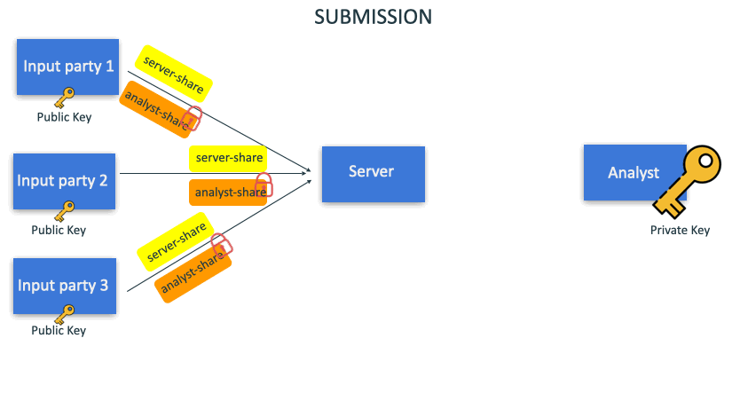

# HumMPC: Summation with Private Deletion

## Installation

```bash
npm install
```

## Running

### Manual

1. Run the server with

```bash
node server.js
```

2. Run the analyst with

```bash
node analyst.js
```

3. Input data with

```bash
node input-party.js input ${token} ${input_val}
```

where `${token}` could be any token such as an email

If an input-party wishes to delete data, it could be done before analyst starts computation

```bash
node input-party.js delete ${token}
```

4. Hit enter in the analyst window to start computation! The sum of all inputs (that are not deleted) will be revealed.

### Automatic

```bash
make run
```

Input in the 3rd window as the input party

## Goals

Secure multi-party computation allows input-parties to perform aggregations on their data without anyone being able to know another individual's data.

HumMPC implements an algorithm that not only performs secure summation, but also allows input-parties to securely delete their data using a token easy to remember, such as an email address, which will also be kept private. Also, the deletion process is private, as no one would know who have requested deletion.

### Base algorithm for summation



## Benchmark

See `test` folder

## Formatting

```bash
npm run lint
npm run format
```